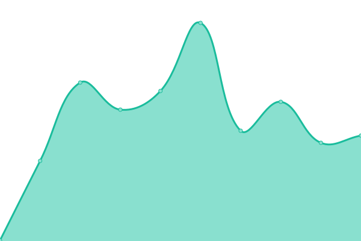
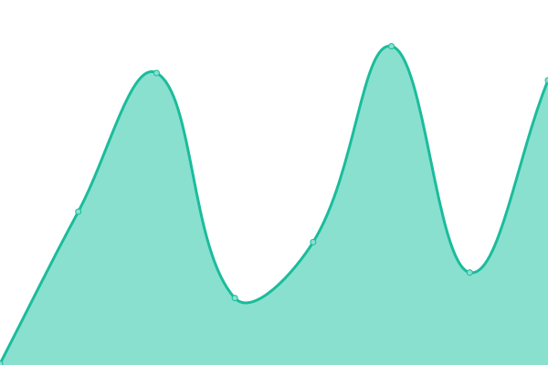
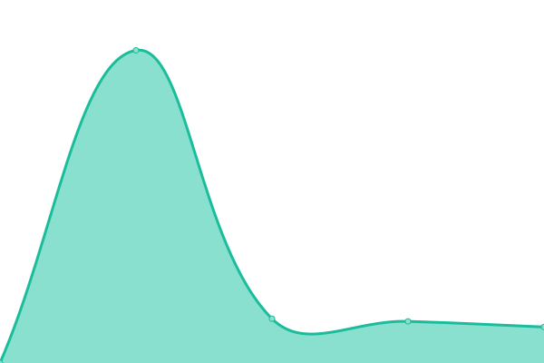

# [📈 Live Status](https://upptime.wdym.info): <!--live status--> **🟩 All systems operational**

This repository contains the open-source uptime monitor and status page for [UnderCurve](http://undercurve.wdym.info), powered by [Upptime](https://github.com/upptime/upptime).

With [Upptime](https://upptime.js.org), you can get your own unlimited and free uptime monitor and status page, powered entirely by a GitHub repository. We use [Issues](https://github.com/UnderCurve/Upptime/issues) as incident reports, [Actions](https://github.com/UnderCurve/Upptime/actions) as uptime monitors, and [Pages](https://upptime.wdym.info) for the status page.

<!--start: status pages-->
<!-- This summary is generated by Upptime (https://github.com/upptime/upptime) -->
<!-- Do not edit this manually, your changes will be overwritten -->
<!-- prettier-ignore -->
| URL | Status | History | Response Time | Uptime |
| --- | ------ | ------- | ------------- | ------ |
|  [Bio](https://www.wdym.info) | 🟩 Up | [bio.yml](https://github.com/UnderCurve/Upptime/commits/HEAD/history/bio.yml) | 

 251ms
     
 | 

<a href="https://upptime.wdym.info/history/bio">100.00%</a>
    

|  [shortlink.json](https://l.wdym.info) | 🟩 Up | [shortlink-json.yml](https://github.com/UnderCurve/Upptime/commits/HEAD/history/shortlink-json.yml) | 

 264ms
     
 | 

<a href="https://upptime.wdym.info/history/shortlink-json">100.00%</a>
    

|  [Quoted](https://quoted.wdym.info) | 🟩 Up | [quoted.yml](https://github.com/UnderCurve/Upptime/commits/HEAD/history/quoted.yml) | 

 221ms
     
 | 

<a href="https://upptime.wdym.info/history/quoted">100.00%</a>
    

|  [Upptime](https://upptime.wdym.info) | 🟩 Up | [upptime.yml](https://github.com/UnderCurve/Upptime/commits/HEAD/history/upptime.yml) | 

 211ms
     
 | 

<a href="https://upptime.wdym.info/history/upptime">100.00%</a>
    

|  CDN | 🟩 Up | [cdn.yml](https://github.com/UnderCurve/Upptime/commits/HEAD/history/cdn.yml) | 

 802ms
     
 | 

<a href="https://upptime.wdym.info/history/cdn">18.24%</a>
    

|  Hastebin | 🟩 Up | [hastebin.yml](https://github.com/UnderCurve/Upptime/commits/HEAD/history/hastebin.yml) | 

 455ms
     
 | 

<a href="https://upptime.wdym.info/history/hastebin">18.24%</a>
    

|  Gitea | 🟩 Up | [gitea.yml](https://github.com/UnderCurve/Upptime/commits/HEAD/history/gitea.yml) | 

 555ms
     
 | 

<a href="https://upptime.wdym.info/history/gitea">18.24%</a>
    

<!--end: status pages-->

[**Visit our status website →**](https://upptime.wdym.info)

## 📄 License

- Powered by: [Upptime](https://github.com/upptime/upptime)
- Code: [MIT](./LICENSE) © [UnderCurve](http://undercurve.wdym.info)
- Data in the `./history` directory: [Open Database License](https://opendatacommons.org/licenses/odbl/1-0/)
